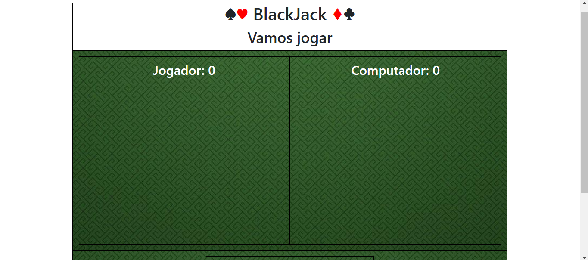

# JOGO DO BLACKJACK
☑️JOGO EM HTML/CSS/JS.

   

## DESCRIÇÃO:
Este é um jogo de Blackjack (também conhecido como 21). Aqui está uma visão geral de como o jogo funciona:

### SUA ESTRUTURA:
- O jogo possui dois jogadores: o jogador humano e o computador.
- Cada jogador tem uma caixa onde suas cartas são exibidas (`#jogador-box` para o jogador e `#computador-box` para o computador).
- Cada jogador também tem uma pontuação que é exibida (`#jogador-pontuacao` para o jogador e `#computador-pontuacao` para o computador).
- Há três botões interativos: "Hit" (para o jogador sacar uma nova carta), "Stand" (para o jogador parar de sacar cartas e passar a vez para o computador), e "Deal" (para iniciar um novo jogo).

### SEU FUNCIONAMENTO:
1. **Sacar Cartas (`blackJackHit()`)**:
   - Quando o jogador clica no botão "Hit" ou pressiona a tecla "1", uma nova carta é sacada do baralho.
   - A carta é exibida na caixa do jogador e sua pontuação é atualizada.
   - Se a pontuação do jogador ultrapassar 21, ele perde automaticamente.

2. **Parar de Sacar (`computadorInteligencia()`)**:
   - Quando o jogador clica no botão "Stand" ou pressiona a tecla "2", a vez é passada para o computador.
   - O computador então começa a sacar cartas automaticamente até que sua pontuação seja pelo menos 16.
   - Após o computador parar de sacar cartas, o vencedor é determinado e o resultado é exibido.

3. **Iniciar Novo Jogo (`blackJackDeal()`)**:
   - Quando o jogador clica no botão "Deal" ou pressiona a tecla "3", um novo jogo é iniciado.
   - Todas as cartas são removidas das caixas dos jogadores, as pontuações são redefinidas e o jogo começa novamente.

4. **Determinação do Vencedor (`computarVencedor()`)**:
   - Após o jogador e o computador pararem de sacar cartas, o vencedor é determinado com base nas regras do Blackjack.
   - O jogador vence se sua pontuação for maior que a do computador e menor ou igual a 21.
   - O computador vence se sua pontuação for maior que a do jogador e menor ou igual a 21.
   - Se ambas as pontuações forem iguais, o jogo termina em empate.

5. **Exibição de Resultados (`mostrarResultadoFinal()`)**:
   - Após determinar o vencedor, uma mensagem é exibida informando o resultado (vitória, derrota ou empate).
   - Os resultados são atualizados na interface do usuário, incluindo o número de vitórias, derrotas e empates.

O jogo também possui funcionalidades para adicionar atalhos de teclado para jogar, como pressionar "1" para sacar uma carta, "2" para parar de sacar e "3" para iniciar um novo jogo.

## NÃO SABE?
- Entendemos que para manipular arquivos em `HTML`, `CSS` e outras linguagens relacionadas, é necessário possuir conhecimento nessas áreas. Para auxiliar nesse aprendizado, oferecemos cursos gratuitos disponíveis:
* [CURSO DE HTML E CSS](https://github.com/VILHALVA/CURSO-DE-HTML-E-CSS)
* [CURSO DE JAVASCRIPT](https://github.com/VILHALVA/CURSO-DE-JAVASCRIPT)
* [CONFIRA MAIS CURSOS](https://github.com/VILHALVA?tab=repositories&q=+topic:CURSO)

## CREDITOS:
- [PROJETO CRIADO PELO "felipeAguiarCode"](https://github.com/felipeAguiarCode/felipeAguiarcode.github.io/blob/master/index.html)
- [PROJETO EDITADO PELO VILHALVA](https://github.com/VILHALVA)
